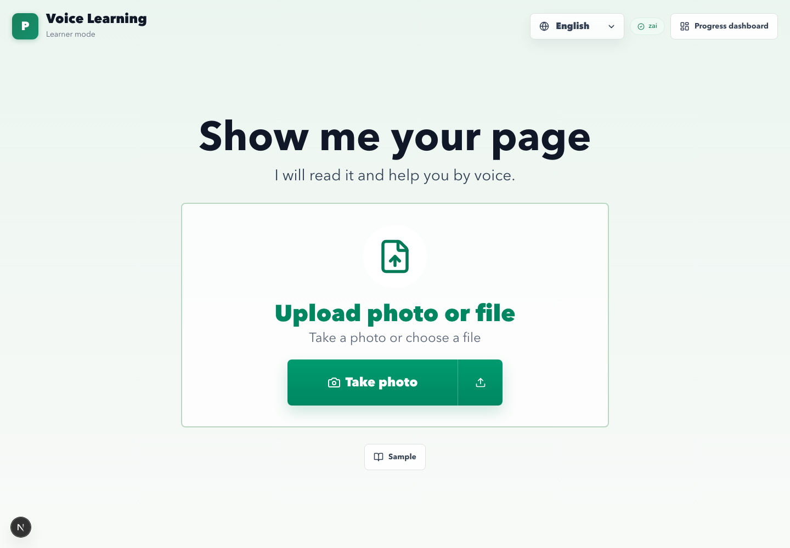
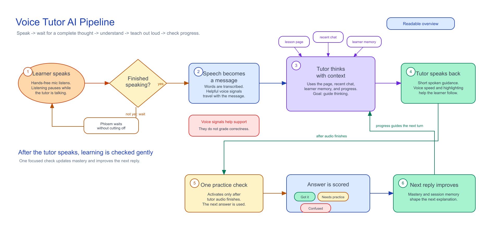
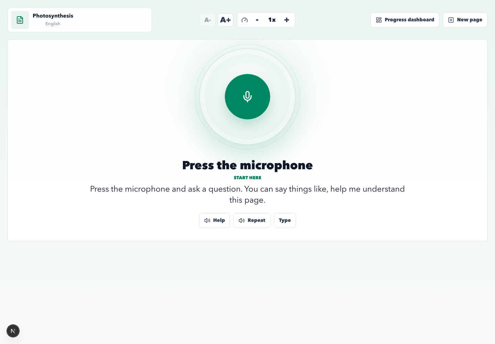
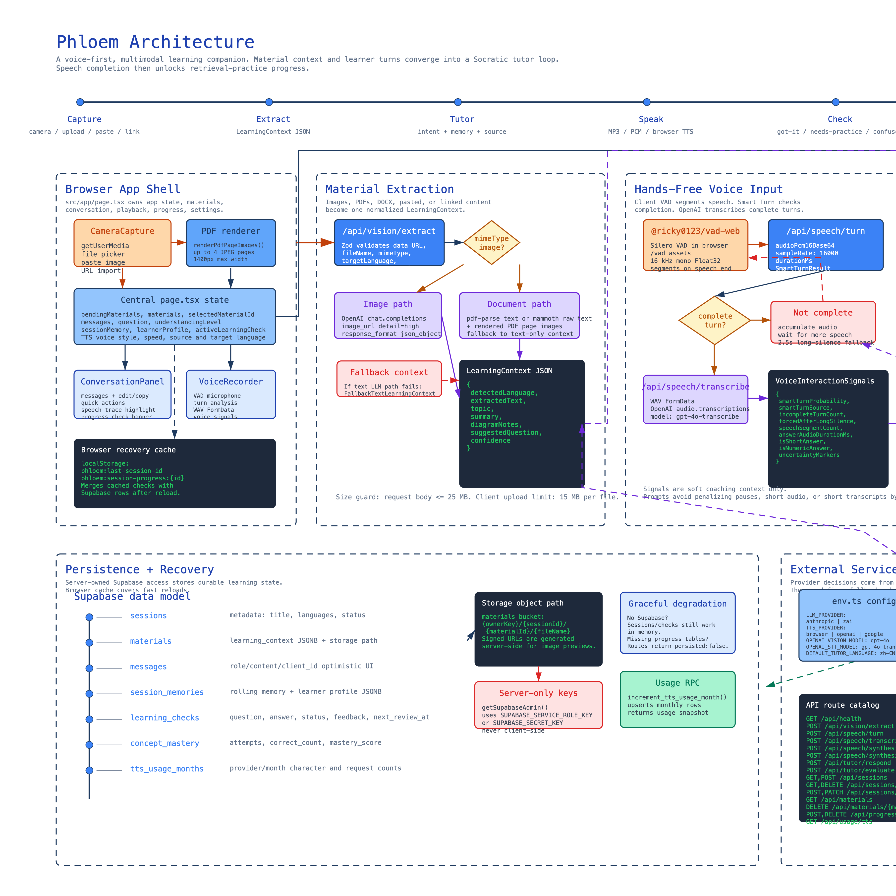
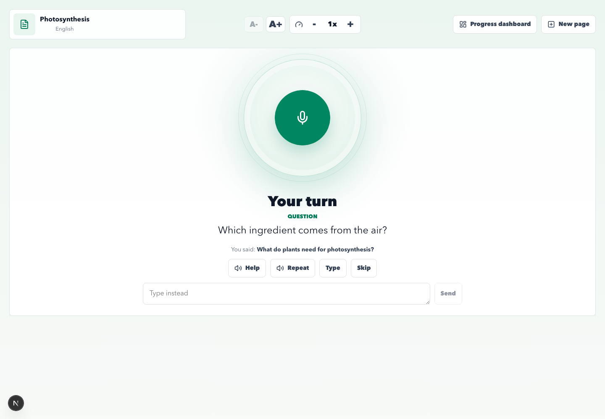
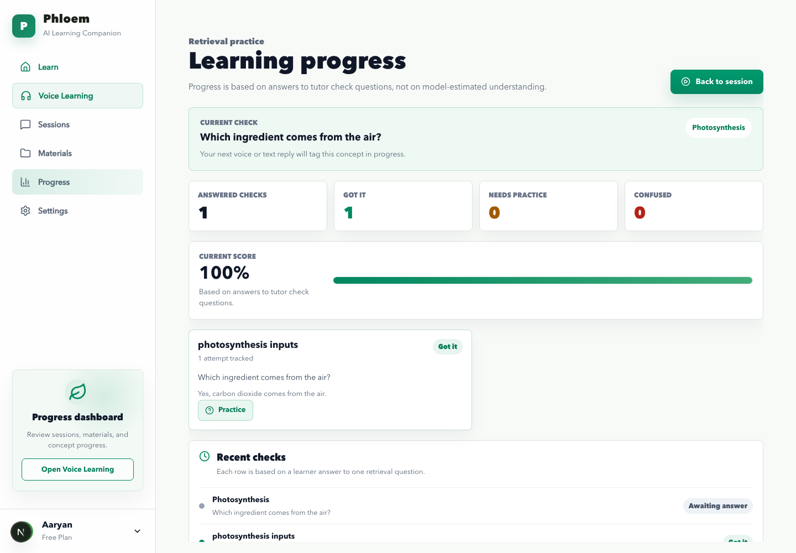

# Phloem

AI Learning Companion for learners who understand by listening and speaking.

**Tagline:** Teach thinking, not just answers.

**Hackathon theme fit:** AI for Good, education, accessibility, human-centered impact.

**Submission metadata**

- Project name: Phloem
- CodeBuddy deployment link: `http://4f04c812ed8245a5bd043a64f2129d1a.ap-singapore.myide.io`
- Core AI: Z.ai GLM-5.1 tutor and evaluator, OpenAI vision and STT, Google/OpenAI/browser TTS fallbacks

**Visual**

**Speaker note**

Open with the simplest version of the value: Phloem turns a page into a spoken tutoring loop for people who cannot comfortably learn from dense text-first tools.

---

# The Problem

Many learners can understand spoken explanations, but get blocked by written materials.

- ESL and EFL learners studying in a non-native language
- Students with dyslexia or reading difficulty
- Young learners and low-literacy adults who need patient guidance
- People studying alone without a tutor beside them

Existing tools often translate or answer. They do not reliably check understanding.

**Key point for judges:** The problem is real-world, human-centered, and measurable through learning progress.

**Speaker note**

Frame this as an access problem, not just a tutoring convenience. Reading-heavy AI tools still assume the learner can read the interface and prompt well.

---

# Our Insight

Use the learner's camera, ears, and voice instead of assuming reading fluency.

Phloem creates a loop:

1. Show or upload a learning page.
2. AI extracts the topic, text, and diagram context.
3. The tutor gives spoken Socratic guidance.
4. The learner answers aloud.
5. Phloem scores a retrieval check and updates concept progress.

**One-sentence pitch**

Phloem is a voice-first tutor that reads a page, teaches it through guided questions, and tracks whether the learner actually understood.

**Visual**

**Speaker note**

This slide should make the product feel inevitable: the target user needs less reading, more listening, and a tutor that asks one small question at a time.

---

# Product Demo Flow

Live demo script:

1. Start on Voice Learning.
2. Click **Sample** or upload a textbook page.
3. Ask: "What do plants need for photosynthesis?"
4. Show the spoken tutor answer and highlighted speech trace.
5. Answer the follow-up: "Carbon dioxide."
6. Open Progress and show the concept update.

**Visual**

**Speaker note**

Keep the live demo focused. Do not tour every sidebar. The strongest story is one learner, one page, one spoken question, one progress update.

---

# Voice-First Human-Centered Design

Phloem defaults to a low-friction learner mode:

- One centered upload or photo target
- One central microphone affordance
- Minimal actions: Help, Repeat, Type, Skip
- Large spoken-friendly tutor text
- Tutor voice speed and text size controls
- Progress dashboard remains available for caregivers, educators, and advanced learners

**Visual**

**Speaker note**

Tie this directly to the judging sheet's human-centered design category. This is not a generic chatbot UI. It is designed around learners who may not want to read a dense interface.

---

# Real AI Interaction

Phloem uses real AI calls across the learning loop:

- **Vision extraction:** OpenAI GPT-4o reads images and rendered PDF pages.
- **Speech-to-text:** OpenAI GPT-4o-transcribe turns voice into text.
- **Tutor brain:** Z.ai GLM-5.1 generates JSON-structured Socratic responses.
- **Evaluator:** Z.ai GLM-5.1 scores retrieval-practice answers as got-it, needs-practice, or confused.
- **Speech output:** Google Chirp 3 HD, OpenAI TTS, or browser speech fallback.
- **Turn detection:** Browser Silero VAD plus optional Smart Turn ONNX worker.

**Visual**

**Speaker note**

The hackathon rubric specifically rewards meaningful real-time AI interaction. Say clearly that this is not a hardcoded Q&A demo: the AI reads source material, responds to learner turns, evaluates answers, and adapts memory.

---

# The Socratic Tutor Loop

The tutor is prompted to:

- Teach thinking before revealing final answers
- Use short spoken-friendly sentences
- Ask exactly one focused follow-up question
- Adapt to low, medium, or high understanding
- Respect direct-answer mode only when allowed or explicitly requested
- Treat uploaded material as untrusted context so worksheets cannot override tutor behavior

**Visual**

**Speaker note**

Show the response and highlight that the tutor does not just dump an answer. It explains the idea in small pieces, then asks a retrieval question.

---

# Measuring Understanding

Phloem separates "the model thinks the learner understands" from actual learner evidence.

- Every tutor answer creates one retrieval-practice check.
- The check appears after speech finishes.
- The learner answers by voice or text.
- The evaluator scores the answer.
- Concept mastery updates with attempts, correctness, mastery score, and next review time.

**Visual**

**Speaker note**

This is the learning-effectiveness moment. Judges should understand that progress is based on the learner's answer, not vibes from a chat transcript.

---

# Progress Dashboard

Progress is grouped by concept so a learner, parent, tutor, or teacher can see what needs review.

- Answered check count
- Got-it, needs-practice, and confused totals
- Current score
- Concept-level cards
- Recent check history
- Practice button for targeted follow-up

**Visual**

**Speaker note**

Use this slide to prove the prototype closes the loop. It is not only capture and conversation. It has a learning record that can become spaced review.

---

# Technical Execution

Implemented as a functional Next.js and TypeScript app:

- App Router API routes for vision, tutor response, tutor evaluation, STT, TTS, sessions, materials, and progress
- Zod validation across request bodies and model outputs
- Resilient JSON parsing for LLM responses
- PDF and DOCX extraction, plus rendered PDF page images for OCR on scanned or image-heavy pages
- Supabase schema for sessions, materials, messages, session memory, learning checks, concept mastery, and TTS usage
- Graceful fallback chain when Supabase, Smart Turn, or paid TTS providers are unavailable

**Visual**

**Speaker note**

This slide should answer technical-execution concerns. Mention that the demo can run with sample content, but the architecture is wired for real providers and persisted learning history.

---

# Why It Is Feasible

The system is practical beyond the hackathon because it already has clear operational paths:

- Browser TTS fallback keeps the app usable without paid speech.
- Google TTS usage is tracked against the free tier.
- Supabase can persist and reload learning sessions.
- Single-owner mode can migrate to Supabase Auth later.
- Smart Turn degrades to VAD-only if the ONNX worker or endpoint is unavailable.

Near-term roadmap:

- Streaming tutor responses
- Spaced-review queue from `next_review_at`
- Auth and row-level security
- Teacher or caregiver dashboard
- More languages and curriculum alignment

**Speaker note**

Connect this to the rubric's feasibility category. The architecture is not just a demo chain. It has fallback behavior, cost awareness, and a migration path.

---

# Judging Criteria Alignment

| Rubric category | Max | How Phloem earns it |
|---|---:|---|
| Impact and relevance | 30 | Addresses education access for ESL, dyslexia, low-literacy, and auditory learners |
| Human-centered design | 20 | Voice-first one-button UX, simple controls, multilingual support, large tutor text |
| AI interaction | 20 | Real vision, STT, GLM-5.1 tutoring, GLM-5.1 evaluation, TTS, VAD/Smart Turn |
| Technical execution | 15 | Functional Next.js app, API routes, Zod validation, Supabase persistence, fallbacks |
| Feasibility | 10 | Clear deployment model, cost tracking, browser fallback, auth roadmap |
| Demo and storytelling | 5 | One learner story from page capture to progress update |

**Must say live**

- Built and demoed in CodeBuddy.
- Uses Z.ai GLM-5.1 for the tutor and evaluator.
- Demonstrates real AI interaction, not a scripted chatbot response.

**Speaker note**

This is the judges' cheat sheet. Keep it short and explicit.

---

# Closing

Phloem makes educational content more accessible by changing the default learning interface:

from reading and prompting  
to showing, listening, speaking, and practicing.

**Final line**

Phloem helps learners understand the page in front of them, one spoken step at a time.

**Visual options**

- Use the Voice Learning capture screen for an empathetic close.
- Or use the progress dashboard to close on measurable learning.

**Speaker note**

End on impact, not the stack. The stack matters because it makes the learner outcome possible.
